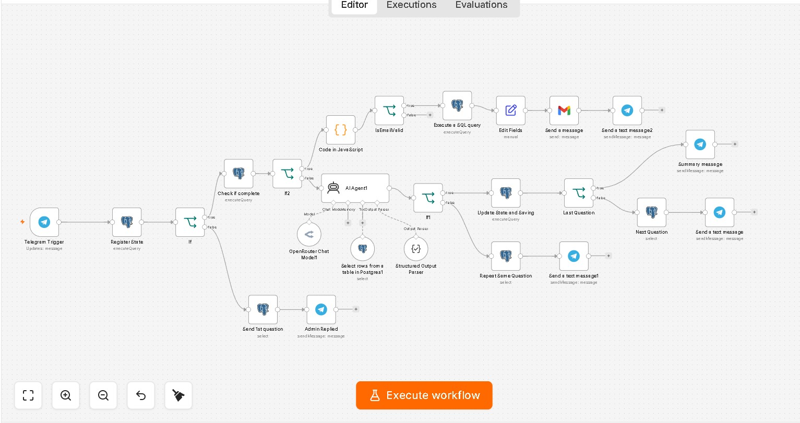

# Boni — AI Booking Assistant for Auto Repair Shops

A production chatbot that lets customers book workshop appointments through natural conversation on **Telegram** and **WhatsApp Business Cloud API** — no app, no forms, no manual data entry.

The bot walks the customer through a guided booking flow (name, branch, service package, schedule), validates every answer with an LLM against business rules stored in PostgreSQL, saves the booking, and instantly sends an HTML confirmation email. It runs autonomously 24/7, reducing booking response time from hours to seconds.

> 🖼️ *Demo*
>
> | Conversation | Workflow canvas |
> |---|---|
> |  |  |

---

## Architecture

```
Customer ──▶ Telegram Bot API / WhatsApp Business Cloud API
                      │  (webhook)
                      ▼
                ┌──────────┐     state machine      ┌──────────────────┐
                │   n8n    │ ◀──────────────────▶  │ PostgreSQL (Neon) │
                │ workflow │   stored procedures    │ questions/answers │
                └──────────┘                        │ bookings/state    │
                  │      │                          └──────────────────┘
                  │      └──────▶ OpenRouter LLM (answer validation,
                  │               structured JSON output)
                  ▼
                Gmail API ──▶ HTML booking confirmation email
```

**Stack:** n8n (orchestration) · Neon PostgreSQL (state + business rules) · OpenRouter LLM via AI Agent node (validation) · Telegram Bot API · WhatsApp Business Cloud API · Gmail API

---

## How it works

### 1. Database-driven conversation state machine

Instead of hardcoding the dialogue in the workflow, every question and its validation rules live in PostgreSQL:

- `t_question` — ordered list of booking questions (name, branch, package, schedule, …)
- `t_answer` — valid answers and natural-language rules per question (e.g. allowed branches, allowed days/time ranges)
- Stored functions handle all state transitions:
  - `getuser(chat_id)` — registers a new user or returns their current position in the flow
  - `updatestate(chat_id, answer)` — saves a validated answer and advances the state
  - `isformcomplete(chat_id)` — checks whether all questions are answered
  - `sumtojson(chat_id, email)` — assembles the final booking summary as JSON

This makes the bot **fully configurable without touching the workflow**: adding or reordering questions is a database change, not a code change.

### 2. LLM-powered answer validation

Free-text user answers are validated by an AI Agent (OpenRouter) that:

1. Calls a PostgreSQL tool to fetch the valid answers/rules for the current question
2. Interprets natural-language rules (e.g. "weekdays only, 09:00–17:00")
3. Returns strict structured JSON via an output parser:

```json
{ "is_valid": true, "clean_answer": "Senin", "reason": "" }
```

Invalid answers trigger a friendly retry with the same question — the flow never breaks on unexpected input.

### 3. Confirmation pipeline

Once the form is complete, the bot extracts and validates the customer's email (regex in a Code node), persists the booking, builds a summary from a database view, and sends a formatted HTML confirmation email via Gmail — then confirms delivery back in the chat.

---

## Reliability

Built with a "no silent failures" mindset from 10+ years in banking backend systems:

- **Strict output parsing** on every LLM call — malformed responses never reach the database
- **Validation-first flow** — state only advances on a confirmed valid answer
- **Centralized error handling** (companion workflow): a global error handler logs every failure to PostgreSQL and pushes real-time alerts to Telegram

---

## Repository contents

| Path | Description |
|---|---|
| `workflows/boni-booking-bot.json` | Sanitized n8n workflow export (Telegram version) |
| `db/schema.sql` | Tables, views, and stored functions |
| `docs/` | Screenshots and diagrams |

---

## Running it yourself

1. Import `workflows/boni-booking-bot.json` into n8n (**⋯ → Import from File**)
2. Create your own credentials — the export contains **no secrets**, only placeholders:
   - Telegram Bot API (via @BotFather)
   - PostgreSQL (Neon or any Postgres)
   - OpenRouter API key
   - Gmail OAuth2
3. Run `db/schema.sql` to create the tables and stored functions, then seed `t_question` / `t_answer` with your own flow
4. Activate the workflow — n8n regenerates the webhooks automatically

---

## About

Built by **Feri Supriadi** — Data Engineer & AI Automation specialist with 10+ years of backend and data engineering experience in banking and finance.

- GitHub: [FX1302](https://github.com/FX1302)
- LinkedIn: [Feri Supriadi](https://www.linkedin.com/in/feri-supriadi-ba0792359/)
